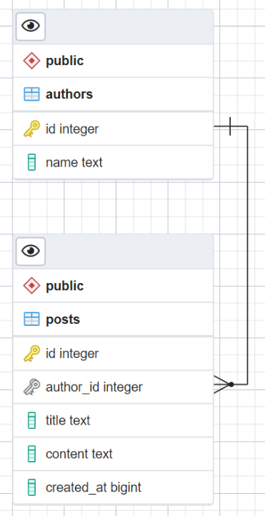

# GoNews

REST API, позволяющий выполнять следующие операции: 
    • Получение списка всех статей из БД, 
    • Добавление статьи в БД, 
    • Обновление статьи в БД, 
    • Удаление статьи из БД.

Структура статьи:

	|ID         |int	|
	|Title      |string	|
	|Content    |string	|
	|AuthorID   |int	|
	|AuthorName |string	|
	|CreatedAt  |int64 	|

Поддержка БД PostgreSQL, MongoDB.

Выбор с какой БД работать осуществляется в файле **cmd/server/server.go**

Файл schema.sql для создания стркктуры Postgres БД.

ER-диаграмма Postgres БД:
